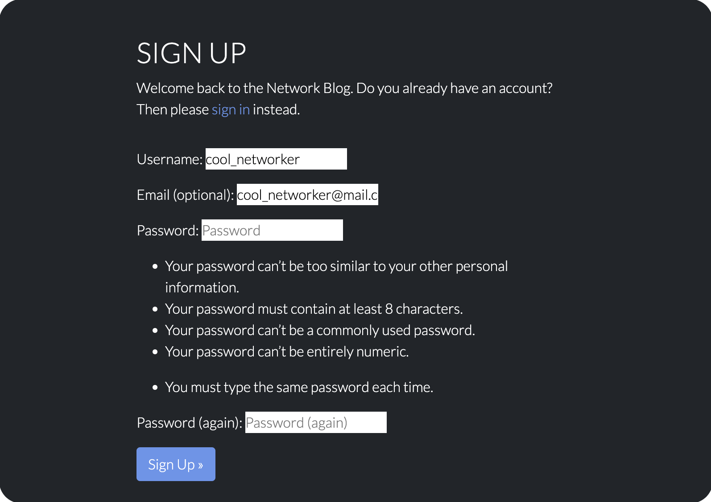
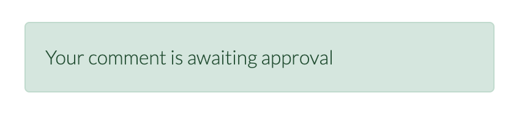
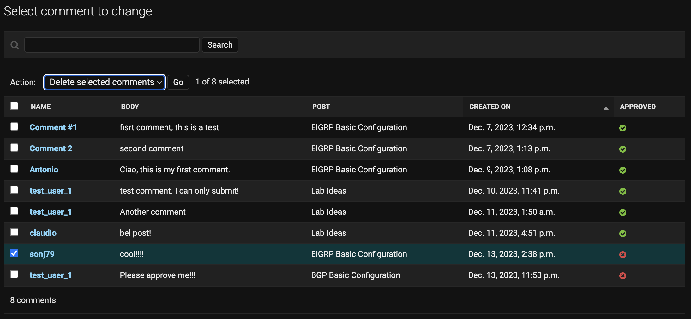
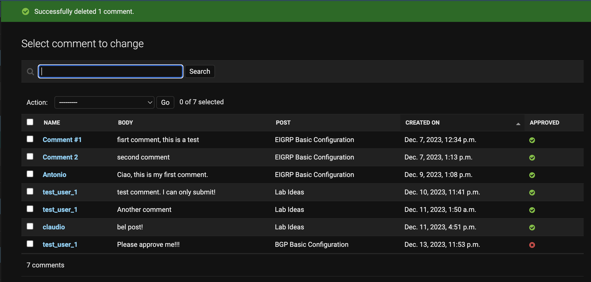
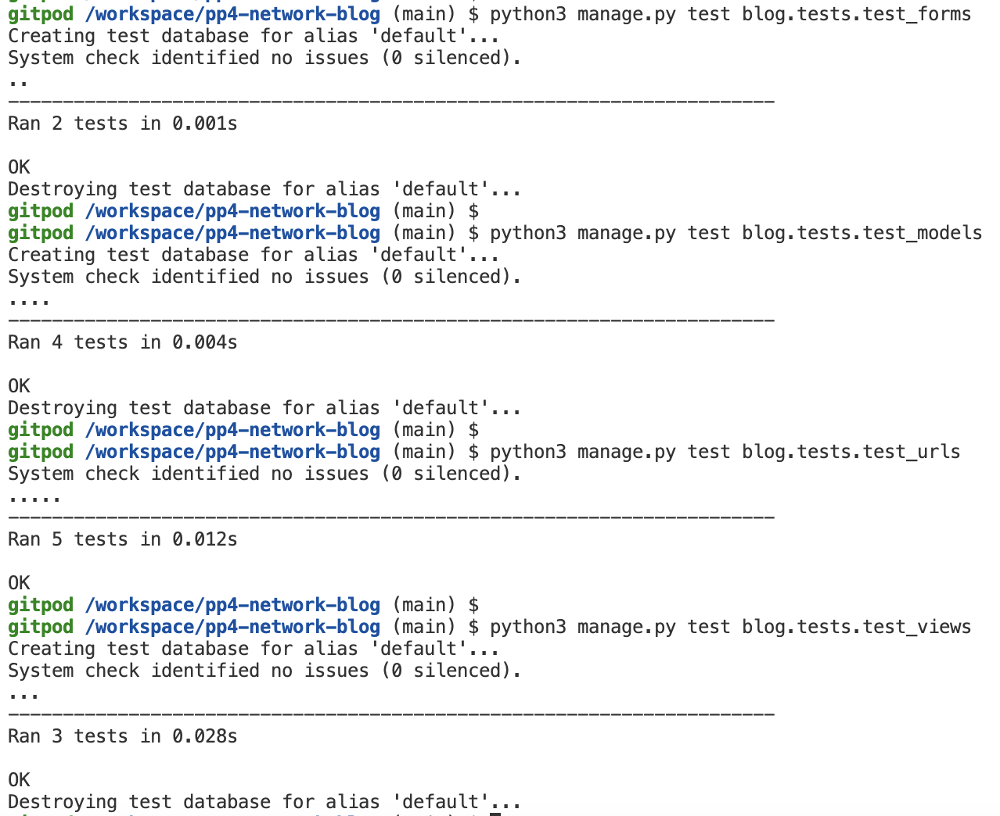

# Network Blog

[View published site on Heroku](https://pp4-network-blog-45c9aa617027.herokuapp.com/).

Image from [Am I Responsive](https://ui.dev/amiresponsive)

## Project Overview

Network Blog is a website that aims to provide a blog-style website for various networking topics which user can view and interact with via comments and likes by signing up and creating an account or logging into and existing one. This site has been created as part of my Portfolio Project 4 for Code Institute Diploma in Full Stack Software Development (E-commerce Applications).

## Table of Contents

1. [User Experience (UX)](#ux)
    * [Strategy](#strategy)
        * [Project Goals](#project-goals)
        * [User Stories](#user-stories)
    * [Scope](#scope)
    * [Design](#design)
        * [Colours](#colours)
        * [Typography](#typography)
        * [Imagery](#imagery)
    * [Skeleton](#skeleton)
        * [Wireframes](#wireframes)
        * [Database](#database)
2. [Features](#features)
    * [Current Features](#current-features)
    * [Future Features](#future-features)
3. [Technologies Used](#tech-used)
4. [Testing](#testing)
    * [User Stories Testing](#user-testing)
    * [Automated Testing](#auto-testing)
5. [Deployment](#deployment)
6. [Credits](#credits)
7. [Acknowledgements](#acknowledgements)

## User Experience (UX) 

## Strategy 

### Project Goals 

The main business goal for Network Blog is to provide users with a blog-style website with various topics, covering different technologies, accessible for the user to view. The user can create an account to be able to further interact with these blog posts via likes and adding comments.

The main target audience for this website are other network engineers who enjoy new challenges and study new technologies, experiencing a wide type of topics and following case studies, laboratories and configuration discussions, from different levels of knowledge. This is also a website for users to be able to share their comments and reviews about opinions and experiences with the community.

### User Stories 

* __Site User Goals:__

  * As a Site User I can like or unlike a post so that I can interact with the content
  * As a Site User I can leave comments on a post so that I can be involved in the conversation
  * As a Site User I can register an account so that I can comment and like
  * As a Site User/Admin I can view comments on an individual post so that I can read the conversation
  * As a Site User/Admin I can view the number of likes on each post so that I can see which is the most popular or viral
  * As a Site User I can click on a post so that I can read the full text
  * As a Site User I can view a list of posts so that I can select one to read
  * As a Site User I can navigate easily through the site and find the relevant information with ease
  * As a Site User I can learn more about the site the purpose of the web app
  * As a Site User I can search keywords for specific recipes
  * As a Site User I can contact the site owner regarding any feedback or queries

* __Site Owner Goals:__

  * As a Site Admin I can approve or disapprove comments so that I can filter out objectionable comments
  * As a Site Admin I can create draft posts so that I can finish writing the content later
  * As a Site Admin I can create, read, update and delete posts so that I can manage my blog content
  * As a Site User/Admin I can view comments on an individual post so that I can read the conversation
  * As a Site User/Admin I can view the number of likes on each post so that I can see which is the most popular or viral
  * As a Site Admin I can prevent unauthorised users from having access so that they cannot access admin content or other users' profiles

## Scope 

To achieve the strategy goals, I want to implement the following features:

* A navigation bar fixed at the top of the screen which will allow the user to easily navigate and find the relevant sections.
* A Home section which will allow the user to find out about the website and view posts.
* An About Me page to inform the user about this website.
* A Login page for existing users to access their account to allow to like and add comments.
* A Register/Signup page to allow new users to create an account.
* A Blog post page to view the selected post in more detail for the posts and add comments/like the post.
* A Search bar to allow users to enter specific keywords to be able to locate desired posts.
* A Footer located at the bottom of the website which allows the user to access social media links.
* A fully responsive design that will work on different devices including desktop, tablets, and mobile devices, allowing users to access the site anytime and anywhere.
* A Contact page to allow users to leave any feedback or queries.
* Full CRUD functionality for Admin to allow to Create, Read, Update and Delete posts.

## Design 

### Colours 

I have used white for the overall background colour for the website, accompanied by black and #212529 for the header and footer to notably distinguish this from the main content.

For the text, black has been used against the white background and white has been used against the black header and footer. This opposite contrast has been chosen for ease of visibility, so users are able to read the text without any additional difficulty.

In addition, cornflowerblue colour has been used as a complementing accent to the website for the logo and hover links without causing any distractions to the user viewing the website.

### Typography 

The fonts were obtained from [Google Fonts](https://fonts.google.com/).

More specifically, Roboto and Lato fonts were used for this project, they are very similar and work very well togheter, giving the user an organic view of the page text.

For my logo text I have used Roboto.

For the heading text I have used Lato.

I have avoided using overly stylised fonts, which can be difficult to read for users, therefore ensuring the website is more accessible to users with visual impairments.

In the event the font fails to load, I have used sans-serif as a back-up font.

### Imagery 

Images are obtained from AI Image Creator Microsoft Bing with Dall-E 3 integration [Microsoft Bing](https://www.bing.com/images/create) website.

I have used imagery appropriate to the website’s content to provide a more visual experience to the user.

All the images used in this project were generated by me.

## Skeleton 

### Wireframes 

Wireframes were created using [Lucidchart](https://www.lucidchart.com/).

The wireframes have examples of desktop, tablet, and mobile phone displays.

* [Home](docs/images/home.png)
* [About Me](docs/images/about-me.png)
* [Blog Post](docs/images/blog-post.png)
* [Register](docs/images/register.png)
* [Login](docs/images/login.png)

Overall, the finished project design is similar to what I had originally intended to create as per my wireframes. However, there are some minor differences on the blog post section with the arrangement of the content.

### Database 

A relational database was used for this project.

During production SQLite/Postgres was used as the main database, and for deployment all data was migrated to Heroku Postgres.

Please note that for testing purposes SQLite database was used. In the settings.py code was added to allow for the databases to be swtiched between SQLite for testing and Postgres for regular production. When DEVELOPMENT = True, then the SQLite database will be used for testing, and when this is set to False, then the Postgres database will be in use.

The database diagram was created using [dbdiagram.io](https://dbdiagram.io/home).

The database contains the following models, once of which is a custom model - Contact.

* __Post__: Contains information about posts submitted by admin, has a relationship with the User model.
* __Comment__: Contains information about comments submitted by the user, has a relationship with the Post model.
* __Contact__: Contains information about form submitted by a site visitor, has no external relationships with other models.
* __User__: Contains information about the user, this is a Django built-in model, has a relationship with the Post model.

## Features 

### Current Features 

For this project I opted for a website with different pages accessed by clicking the nav links, this is fully responsive and consists of a header, footer and the following main sections; Home, Blog Post, Sign Up, Login, Search, About Me and Contact Me.

__Navigation__:

* This feature is present on all the pages/sections and is fixed to the top.
* The header section has a fully responsive navigation bar which consists of the logo, located on the left-hand side.
* The navigation buttons for Home, Sign Up, Login, About Me and a Search bar (located on the right-hand side).
* Style has been applied to the logo and buttons on the left-hand side so the user is able to hover over these to signify that the links can be clicked.
* The Search bar has placeholder text to indicate to the user that they can enter text in the box provided.
* Style has also been applied to the search button next to the input box to indicate to the user that this has been selected and can be clicked.

__Home__:

* This is the default page displayed when the user accesses the website.
* This page can also be viewed by clicking the Network Blog logo or the home button from the navigation.
* An introductory message displayed to the user.
* Blog posts displayed (max of 6) per page.
* There is a 'Next' button that allows user to click and navigate to the next page to view more posts.
* Alternatively 'Prev' button can be clicked to return a page back.
* Blog posts are displayed from most recent to oldest.
* Each post is displayed in a card style with an image, author, date, title and like count.
* Style has been applied so the user can hover over the text for the posts which will underline to indicate that this can be selected.
* Selecting the clickable text will take the user to the 'Blog Posts' page to display the full content of the post.

__About Me__:

* User can access this section by clicking the 'About Me' button from the navigation.
* User is able to scroll further down the page and access the text which provides more detail about the website and it's purpose.

__Blog Post__:

* Accessed once the user selects a post post from the 'Home' or 'Search' page.
* post title and image displayed at the top (image is not displayed on smaller devices).
* Content is then followed.
* Further below is the comment section which users can view even if not logged in.
* Comment section is available and displayed for logged in users who can submit a comment.
* This is then sent for approval which is a feature only the Admin can access.
* Alert is displayed to indicate the comment has been sent for approval.
* Approved comments can be viewed on the post.

__Sign Up__:

* Accessed from the navigation bar by selecting the 'Sign Up' button.
* Once selected, the user is taken to the 'Sign Up' page.
* New users are prompted to enter a username, email (optional), password and password again to confirm.
* All fields apart from the email (optional) are required for the user to be able to create an account, otherwise an error is displayed.
* Upon successful creation the user is then able to login to the account.
* Alert is displayed to indicate that the user has signed in.
* Existing users are provided with the sign in link to take them to the 'Login' page.

__Login__:

* Accessed from the navigation bar by selecting the 'Login' button.
* Once selected, the user is taken to the 'Login' page.
* Existing users can enter their username and password and click the login button.
* Upon successful login, user is taken to the 'Home' page.
* Alert is displayed to indicate that the user has signed in.
* Incorrect username and password will faily to log the user into their account and a message will be displayes on the 'Login' page to indicate this.
* New users are provided with the register link to take them to the 'Sign Up' page to create an account.

__Logout__:

* Option only available to users who are currently logged in.
* Accessed from the navigation bar by selecting the 'Logout' button.
* Once selected, user will be taken to the 'Sign Out' page to confirm that they wish to sign out from their account.
* User can select the sign out button option which will successfully sign out the user from their account and return them to the home page.
* Alert added to indicate that the user has signed out.

__Search__:

* Accessed from the navigation bar in the top right-hand corner.
* Placeholder text added to indicate to the user that text can be entered in the input box.
* User cannot submit an empty search and user has to enter a max of 2 characters otherwise an error is displayed.
* User is able to click the search button once the requirements are met (as stated above), this will take the user to the 'Search' page.
* User is able to scroll down and view the displayed results of the posts which match the keywords entered.
* Prior to the search results, the user is displayed with the keyword searched and below the results are displayed.
* For any successful matches display the post card (same as the ones on the 'Home' page), the user can click this and be taken to the post page.
* For any unsuccessful matches, the user is displayed with a message to state that no results have been found for this keyword.

__Footer__:

* This feature is present on all the pages/sections and is fixed to the top.
* Social media links can be accessed by the user.
* Hover style applied to signal to the user which link they are selecting and opening.
* Links open in a new tab so the user is not taken away from the main website and can easily return.

__Contact__:

* Accessed once the user clicks the 'About Me' link from the navigation.
* User is displayed with a contact form to fill out with the required fields of email, subject and message.
* Form can be submitted via the 'Send' button upon which the user will receive a confirmation page to indicate message has been submitted successfully.
* Admin can view the form submitted by the user in the admin only section to view the message.

__Features Exclusive to Admin__:

* Only the Admin can approve and delete user comments.
* Only the Admin can create, update and delete posts.

### Future Features 

Due to hard time constraints, I was unable to apply additional features, in the future I would like to implement the following:

* Allow users to edit/delete their own posted comments. Verification would need to be added to ensure that the user is only able to edit/delete their own comments and be restricted from amending any other users' comments.

* Allow users to create their own posts, this would go to Admin for approval to ensure that the content is consistent and appropriate to the website.

* Add a Lab section on the blog, providing scenarios and startup-config for the devices to test for every laboratory, allowing the users to challenge their skills and knowledge.

* Add a tick list on the blog lab section for the posts. This will allow users to tick off against each of the lab task to signify which items the user completed and which they do not.

* Add a 404 page.

## Technologies Used 

For this project the main languages used are __HTML5__, __CSS3__, __JavaScript__, __Python__, __Django__ and __Heroku Postgres__.

I have also utilised the following frameworks, libraries, and tools:

* [Bootstrap v5.1.3](https://getbootstrap.com/):
    * Bootstrap has been used for overall responsiveness of the website and for the layout with the addition of select classes.
* [GitPod](https://www.gitpod.io/):
    * I used GitPod as the IDE for this project and Git has been used for Version Control.
* [GitHub](https://www.github.com/):
    * GitHub has been used to create a repository to host the project and receive updated commits from GitPod.
* [Lucidchart](https://lucidchart.com/):
    * I used Lucidchart to create the wireframe for the website for the basic structure and layout.
* [dbdiagram](https://dbdiagram.io/home):
    * I used dbdiagram to create the database diagram model for the website.
* [Google Fonts](https://getbootstrap.com/):
    * I have used Google Fonts to import fonts for styling purposes for this project.
* [Font Awesome](https://fontawesome.com/):
    * Font Awesome was used to apply icons in the Footer sections.
* [GIMP v2.10](https://www.gimp.org/):
    * GIMP image manipulator program was used to edit the favicon used this project.
* [Chrome Dev Tools](https://developers.google.com/web/tools/chrome-devtools):
    * Chrome Dev Tools was used to test the site, assist with debugging issues and run reports from Lighthouse.
* [W3C Markup Validation Service](https://validator.w3.org/):
    * The W3C Markup Validation Service was used to validate the HTML document for this project and to identify any issues with the code.
* [W3C CSS Validation Service](https://jigsaw.w3.org/css-validator/):
    * The W3C CSS Validation Service was used to validate the CSS document for this project and to identify any issues with the code.
* [JSHint Validation Service](https://jshint.com/):
    * The JSHint Validation Service was used to validate the JavaScript document for this project and to identify any issues with the code.
* [PEP8 Online Validation Service](http://pep8online.com/):
    * The PEP8 Online Validation Service was used to validate the Python document for this project and to identify any issues with the code.
* [Heroku](https://www.heroku.com/):
    * Heroku has been used to create a repository to host the project and receive updated commits from GitPod.
* [Django](https://docs.djangoproject.com/en/3.1/):
    * Django was used as the main framework to build this project.
* [Cloudinary](https://cloudinary.com/):
    * Cloudinary was used to store all media and static files for this project.
* [Am I Responsive](http://ami.responsivedesign.is/):
    * Am I Responsive was used to create the header image for the README file.
* [Python](https://www.python.org/):
    * Various Python modules were used to build this project as detailed below and as seen in the requirements.txt file.

## Testing 

Testing for this project was completed manually and some auto unit testing was also implemented.

### User Stories Testing 

From the Home page, the user is presented with the navigation which consists of the Network Blog name, Home button, Sign Up button, Login button, About Me button, Contact Me button and on the right-hand side is the search bar with the Search button. Each of these buttons are operational, the user can click or utilise. The following actions will occur once the user clicks the following buttons:

* Network Blog Name -> Defaults to the Home page, user can click this to take them back to the Home page
* Home button -> Links to the Home page, user can click this to take them back to the Home page
* About Me button -> Links to the About Me page, user can click this to take them to the About Me page
* Sign Up button -> Links to the Sign Up page, user can click this to take them to the Sign Up page
* Login button -> Links to the Login page, user can click this to take them to the Login page
* Contact Me button -> Links to the Contact Me page, user can click this to take them to the Contact Me page
* Search button -> Links to the Search page, user can only click this once the search criteria has been met (cannot be blank and a minimum of 2 characters), this will then allow for the form to be submitted

The user can easily access the navigation as this is fixed at the top of the page and is accessible from all the pages of the website. On desktop view the navigation can be viewed in full but in mobile view this then collapses the post images are not showed.

The main section of the Home page displays the posted posts, there is a max of 6 posts displayed per page. The user can navigate between the post pages by clicking Next button to go to the next page to view more posts or clicking Prev button to go to the previous page. The posts are displayed in date order, the most recent posts are displayed first and the older posts will be displayed at the very end (or on a different page if exceeding 6 posts per page). Each post is presented with a card style with an imagine, the author, post title, post description, posted date and time, and a like count. The user can select any post from the available posts by clicking the post title or description. This action will take the user to the post post page of that particular post.

At the bottom of the page is the footer. The footer is present and can be accessed from any page of the website. The footer provides social media links to the user which they are able to click to take them to the respective social media platforms. The social media links open in a new tab once clicked, this provides for a better user experience as the original website is not lost and the user is able to easily navigate back from where they left off. Further down from there is the copyright text for the website.

The following user stories have been achieved from this section:

* As a Site User I can click on a post so that I can read the full text.
* As a Site User I can view a list of posts so that I can select one to read.
* As a Site User I can locate their social media accounts so I can receive updates and see their following and how well they are known and reliable.
* As a Site User I can navigate easily through the site and find the relevant information with ease.

Selecting the About Me button from the navigation will take the user to the About Me page. The page is simple and it has a section with text the user is able to read. From here the user is able to find out more information about the website and the aim of Network Blog.

The following user stories have been achieved from this section:

* As a Site User I can learn more about the site the purpose of the web app.

Selecting the Sign Up button from the navigation will take the user to the Sign Up page. This page can also be accessed by clicking the links available on the Login page. The page shows the Sign Up section, any existing users with an account are prompted to go to the login page provided from the link. Any new users are prompted to enter the required details to be able to sign up. The fields username, password and password (again) are required fields, therefore the user cannot submit a blank form for these. However the email is an optional field as stated on the form, therefore the user does not need to enter this to sign up to become a member.

If the password section does not match for both fields, then the user will be presented with a message to state that they must type the same password each time to be able to create the account.

If the password is too similar to the username the user will also be displayed with an error message. This is a security feature on the form to ensure the user's account cannot be acessed easily by creating a different and strong password.

Once the sign up form fields have been successfully filled out and the user clicks the sign up button, then the user will be taken back to the Hope page and an alert message will be displayed at the top (below the navigation) to indicate that the user is signed is as their 'username' name. The navigation will now be updated to remove Sign Up and Login buttons with the Logout button.

Alternatively for any existing users with an account already created, by selecting the Login button from the button, this will take the user to the Login page. The link is also accessed from the sign up page for existing users. The page shows the Login section, any new users are prompted to go to the sign up page provided from the link. Any existing users are prompted to enter the required details to be able to login. The user is required to enter their username and password which they previously used to create the account. The user also has an option to tick the 'Remeber Me' checkbox.

Once the user has entered the relevant details and clicked the login button to submit the form, they will be taken back to the Home page and an alert will be displayed at the top of the page (below the navigation) to notify the user that they have logged in successfully. The navigation bar will be changed once logged in as described above in a previous point.

Logged in users have the option to Logout from their account by selecting the Logout button from the navigation. By selecting the Logout button this will take the user to the Logout page. A message prompts the user to confirm if they wish to sign out. Selecting the sign out button will confirm this choice and the user will be taken back to the Home page, and an alter will be displayed to confirm that the user has signed out. Users who do not wish to logout can click back to the Home page from the navigation (or any other page) to undo this action.

Users with an account that are logged in have the option to add comments and like posts on the post detail page once a post is selected.

The main section of the post post is exactly the same for logged in users as is for users who are not logged in. The post title, author, time and date and image are displayed at the top. Then further down is the main post body. At the end of the section, there is a like counter and comment counter displayed which will show how many users have liked the post and how many comments does a post have.

With likes and comments:

With no likes and comments:

After the main post post, logged in users will be displayed with the comments section (on the left) where any posted comments which have been approved by the admin can be viewed, and the comment box (on the right) where the user can submit a comment. The comment box is only available for logged in users, whereas the comments section is visible to both logged in users and users not logged in.

Logged in user view:

Generic view for non-members:

The comment box provides details to the user as to who they are posting as which corresponds to the username they have logged in with. Further down is the main comment body section where the user is able to enter a comment. Once clicking the submit button, the user will be presented with an alert message to state that the comment has been sent for approval. Only the admin can approve comments. Once the admin has approved the comment, this can now be viewed on the post post.

The logged in user is also able to like a post by clicking the heart icon, this will increase the like count by 1. Alternatively, the user can also unlike the post by clicking on the heart icon again which will decrease the count by 1.

The following user stories have been achieved from this section:

* As a Site User I can register an account so that I can comment and like
* As a Site User I can like or unlike a post so that I can interact with the content
* As a Site User I can leave comments on a post so that I can be involved in the conversation
* As a Site User/Admin I can view comments on an individual post so that I can read the conversation
* As a Site User/Admin I can view the number of likes on each post so that I can see which is the most popular or viral

Users are also able to utilise the search functionality on the website. This feature is accessed from the navigation bar located on the right-hand side.

The user is able to enter a keyword corresponding to the desired post they would like to locate in the input box. Once this has been filled out, the user can click the submit button which will take them to the Search page. Users cannot submit a blank form as this field is required, in addition there is a requirement of minimun of 2 characters to be added before the form can be submitted.

For the search results sections, the user is presented with the keyword searched and below that any successful returns of the keyword will display the posts which match this. The post results are displayed in the same manner as the blog posts on the Home page. The user is able to click on the post post which will take them to the post detail page for that post.

Any unsuccessful matches to the user's search will be displayed with a message to say so.

The following user stories have been achieved from this section:

* As a Site User I can search keywords for specific posts

From the navigation, the user is able to select the 'Contact Me' link. Selecting this link will direct the user to the contact page.

From the contact page, the user is presented with a form to fill out to be able to submit the query, this includes the user's email address, subject and main message. These are required fields to enter for the user to be able to submit the form.

Once the form is submitted via the 'Send' button, the user is directed to the confirmation page to indicate successful submission of the query.

The side admin will then be able to view the contact messages in the admin only section of the website.

The following user stories have been achieved from this section:

* As a Site User I can contact the site owner regarding any feedback or queries

__Admin Only User Story Testing__

This section tests the user stories for the Admin only functions of the website.

The admin section is accessed by entering '/admin' at the end of the url for the website. This displayed the login page for the admin from which they can login.

The admin username for this project is: **sonj79**

The site admin has various actions available to be able to manage the website such as:

* Delete users
* Create/edit/delete posts and drafts
* Approve and delete comments

From the home section of the admin page, by selecting the Users link under 'Authentication and Authorization' the admin can view the lists of users currently signed up to the website. The admin also has the permission to delete the users by selecting the username and from the drop down selecting the delete user option.

From the home section, the admin can also view comments added by users some of which are pending approval. This is accessed from the Comments link under the 'Blog' section. Approved comments are indicated with a green tick under the Approved column. Comments pending approval have the red cross icon. To approve the comment the admin has to tick the unapproved comment from the list, then from the action drop down select the 'Approve comments' option. By clicking Go button this will proceed to carry out the action to approve the selected comment. Once the comment has been approved the red cross icon will now become a green tick icon to indicate that the comment has now been approved. The approved comment can also be viewed on the website now.

Alternatively selecting the 'Delete selected comments' action will proceed to delete the comment selected. Users will also no longer be able to view the comment on the website.

From the home section, the admin can also view the posts on the website, create new posts and edit/delete any existing ones. This can be accessed from the Posts link under the 'Blog' section. By selecting this link, this will display all the current posts submitted on the website.

The admin can delete any of these posts by selecting the 'Delete selected posts' action from the Action drop down.

The admin can also click on an existing posts by selecting the post tile to view the editor. From this section the admin can edit the posts content, and also has the option to delete the post or to save the changes.

The admin can also create new posts by selecting the Add Post button. This will open up the editor page which will allow the fields to be populated. The status of the post can also be toggled between Draft or Published. The Published posts can then be viewed on the website, whereas Draft posts cannot.

The admin also has the capability to create, edit and delete posts via the front end of the website.

When logged in as admin, from the navigation the admin has an additional link available 'Add Post'.

Selecting the 'Add Post' link will direct the admin to add a post page. From here the admin can enter the relevant details on the form to submit the form to add a new post to the website. The admin can select whether to create this post as a draft or publish this straight away. Any published posts can be viewed on the home page, and any draft posts can be accessed in the admin section and approved later once editing is completed.

Submitting the form will direct the admin to the home page with a success message.

The admin also has the capability to edit or delete posts. These are displayed on each post on the homepage. If delete option is selected then the post is deleted from the database and this is confirmed via an alert message.

By selecting the edit option, the admin is directed to the edit post page which allows for any changes to be made and saved.

These particular admin only permissions cannot be accessed by any other users, and users cannot edit or delete comments or posts or access another users account.

When a new post is created, a placeholder image is loaded:

The following user stories have been achieved from this section:

* As a Site Admin I can approve or disapprove comments so that I can filter out objectionable comments
* As a Site Admin I can create draft posts so that I can finish writing the content later
* As a Site Admin I can create, read, update and delete posts so that I can manage my blog content
* As a Site Admin I can prevent unauthorised users from having access so that they cannot access admin content or other users' profiles

### Automated Testing 

Further testing was completed importing the Django TestCase. The test files can be located in the blog > tests folder for the project, this consists of the following files:

* test_forms.py
* test_models.py
* test_urls.py
* test_views.py

From the picture above, it is clear all the ptests are passed.

Please note that for testing purposes SQLite database was used. In the settings.py code was added to allow for the databases to be swtiched between SQLite for testing and Postgres for regular production. When DEVELOPMENT = True, then the SQLite database will be used for testing, and when this is set to False, then the Postgres database will be in use.

## Deployment 

The project was developed using GitPod and was deployed via the GitHub repository to Heroku.

The following steps were followed to deploy this project:

1. From the Heroku dashboard, select 'New' in the top right-hand corner.
2. Click 'Create new app'.
3. Enter the app name and choose region as Europe.
4. Click 'Create app'.
5. Select the 'Settings' tab, and scroll down to 'Buildpacks'.
6. Add 'Python' and save changes.
7. Scroll down to 'Config Vars' section, and add the 'KEY' and 'VALUE' for the CLOUDINARY_URL, DATABASE_URL and SECRET_KEY to run the app.
8. At the top of the page, click on the 'Deploy' section.
9. Select Github as deployment method.
10. Select 'Connect to Github', and locate the repository name and click on 'Connect' to link my Heroku app to my Github repository code.
11. To add the Postgres Database, click on the 'Resources' tab.
12. Under Add-ons, search for 'Heroku Postgres', click on the search result for this.
13. Select the 'Hobby Dev-Free' option and click submit order form which will add this to the Add-ons section.
14. Scroll further down, select 'Enable Automatic Deploys' and then select 'Deploy Branch' to deploy project.
15. After it has successfully deployed a 'view' button appears on screen and when clicked opens the deployed application.

Please note as of 18/04/2022, Heroku no longer allows deployment from GitHub and is currently under maintenance. As a workaround the following method is used using the GitPod terminal to deploy any further changes to Heroku.

* Run the command heroku login -i and login when prompted. Then run the following command: heroku git:remote -a your_app_name_here and replace your_app_name_here with the name of your Heroku app. This will link the app to your Gitpod terminal.
* After linking your app to your workspace, you can then deploy new versions of the app by running the command git push heroku main and your app will be deployed to Heroku.

## Credits 

### Content

Posts are created by me and all the content are created in a Laboratory environment with virtual devices using network emulator EVE-NG.
Posts descriptions in the core text are taken partially from Wikipedia:
- https://en.wikipedia.org/wiki/Enhanced_Interior_Gateway_Routing_Protocol
- https://en.wikipedia.org/wiki/Open_Shortest_Path_First

Due to hard time constraints I did not populated all the posts with the article I was suppose to do initially.

### Media

Images are obtained from AI Image Creator Microsoft Bing with Dall-E 3 integration [Microsoft Bing](https://www.bing.com/images/create) website.

Favicon: Generic Router Template

### Code

* To build the search functionality for the website, code from the following [YouTube](https://www.youtube.com/watch?v=AGtae4L5BbI) video tutorial was used to assist with this.

* A large part of this project code was used and inspired from the Code Institute's I Think Therefore I Blog walkthrough to be able to build a base skeleton project. Please note some of the borrowed code has been customised by me to fit this project. I have also added my own code for additional functions for the project.

* [Bootstrap](https://getbootstrap.com/) to help with styling and overall responsivness of the website.

* To assist with the unit testing section of the project, Code Institute's Hello Django Testing tutorial section was utilised as well as the following [YouTube](https://www.youtube.com/watch?v=qwypH3YvMKc&list=PLbpAWbHbi5rMF2j5n6imm0enrSD9eQUaM&index=1) resource.

## Acknowledgements 

* I would like to thank my family and friends for their support throughout this project and for assisting with the testing stage and providing valuable feedback.